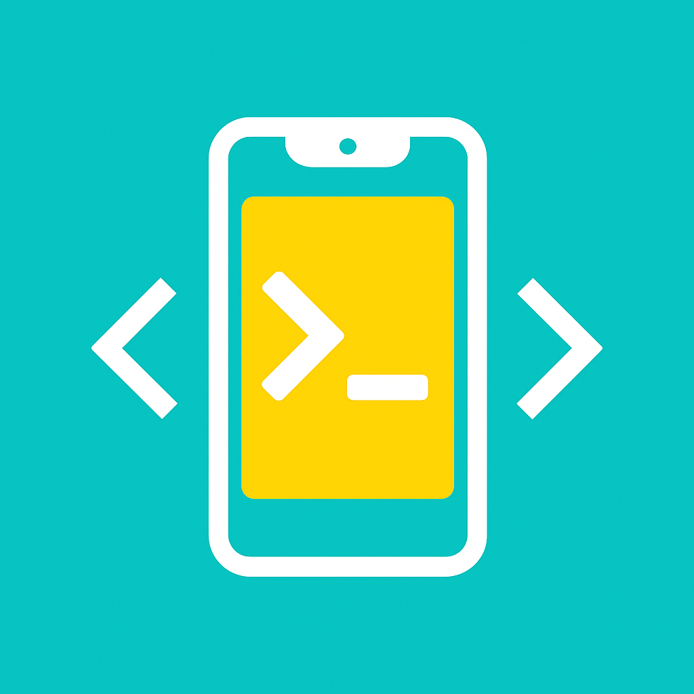

# Alim Terminal

Alim Terminal, VS Code için geliştirilen bir uzantıdır. Terminale `alim new phone` komutu yazıldığında, Flutter ve HTML projelerini bir telefon ortamında çalıştırır.



---

## 🚀 Özellikler

- `alim new phone` komutuyla Flutter ve HTML projelerini başlatır
- Terminal üzerinden otomatik klasör geçişi ve komut çalıştırma
- Modüler yapı: İleride `alim new web`, `alim new desktop` gibi komutlar eklenebilir
- VS Code komut paletinden çalıştırılabilir

---

## 📦 Kurulum

1. Bu uzantı klasörünü VS Code'da açın
2. Terminalden aşağıdaki komutla bağımlılıkları yükleyin:

```bash
npm install
